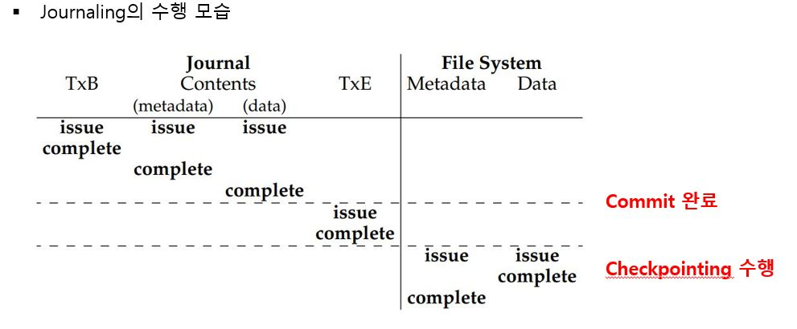

# Journaling

## 저널링이란 ?

- 파일 시스템 안에 저널 영역이라는 특수한 영역을 따로 두고, 디스크에 수행되어야하는 작업 리스트를 먼저 저널 영역에 저장해둔 뒤에 디스크에 실제 작업 수행
- 하나의 수행 작업 세트를 transaction 이라 함

### Transaction

- 하나의 transaction 은 `TxB`, `디스크에 작업할 내용들`, `TxE`로 구성
  - TxB : transaction 의 시작 블록
  - TxE : transaction 의 종료 블록
  - TxE 까지 저널영역에 기록된 것을 transaction 이 commit 되었다고 말하며
  - transaction 의 내용이 disk 에 적용되는 과정을 checkpointing 이라고 한다
    - checkpointing 중 crash 발생하여도, 이후에 파일 시스템이 저널 영역을 탐색하여 commit 된 transaction 내용을 재반영

- 그림

## 목적

- disk 에 특정 작업을 수행하기 위해서는 디스크 상에 존재하는 여러 자료구조를 업데이트해야한다
- 이러한 일련의 업데이트 작업들은 세트로 성공하거나 실패해야지 중간에 누락되면 안 되는데, disk 에 i/o 작업을 하는 것은 한 번에 한 가지씩만 처리되므로 스토리지 장애가 발생하였을 경우 파일시스템의 일관성이 손상된다
- 이를 파일시스템이 깨졌다고 표현하고 이를 막는 해결책 중의 하나로 저널링을 사용하는 파일 시스템이 있다 (ext4, XFS 등)
  - 저널 영역을 보고 어디까지 정상 처리되었으며 어디서부터 재실행하면 되는지 판단하여 rollback, rollforward 가능