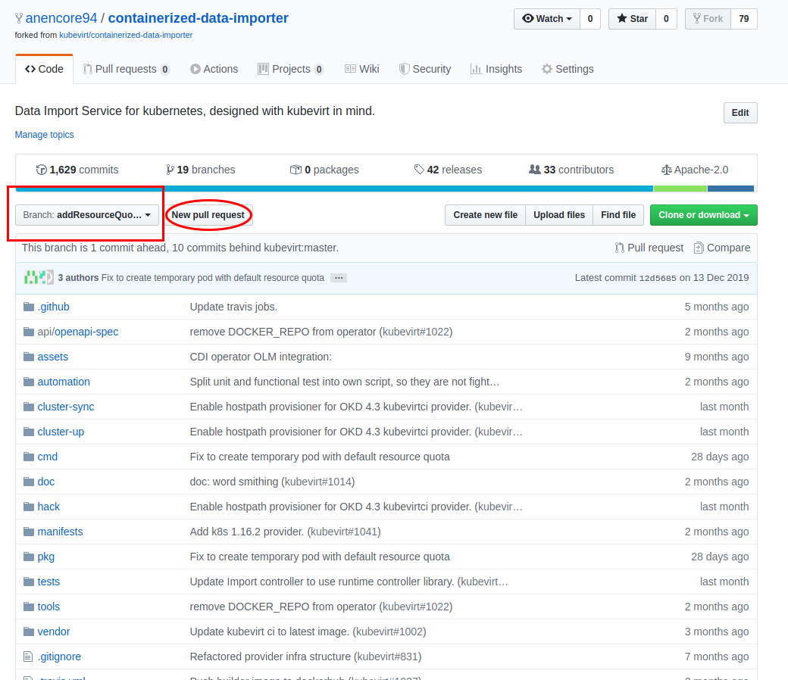

# 초보자를 위한 오픈소스 컨트리뷰션 가이드

> 본 가이드는 오픈소스 컨트리뷰션 경험이 없는 개발자를 대상으로 작성되었습니다.   GitHub 에서 공개한 "Open Source Guide" 를 기반으로 작성되었으며, 사전지식으로는 github 에 대한 기본 지식을 요구합니다.

### Reference

- [Github Open Source Guide](https://opensource.guide/)
  - [Github Open Source Guide 한국어 번역 문서](https://opensource.guide/ko/how-to-contribute/)
- [네이버 오픈소스 가이드 문서](https://naver.github.io/OpenSourceGuide/book/)

### 목록

- 본 가이드는 다음과 같은 파트로 구성되어 있습니다.
  - 오픈소스
  - 오픈소스 컨트리뷰션
  - 코드 관련 오픈소스 컨트리뷰션 절차

------------------

## 오픈소스

### 오픈소스란 ?

- 오픈소스 소프트웨어 (Open Source Software, OSS)의 준말
- 오픈 소스는 소프트웨어 혹은 하드웨어 제작자의 **권리**를 지키면서 **원시 코드를 누구나 열람**할 수 있도록 한 소프트웨어 혹은 오픈 소스 라이센스에 준하는 모든 통칭을 일컫는다. (from wiki)
  - 한 마디로 **소스 코드가 공개된 소프트웨어**

### 주요 오픈소스 라이센스

- 오픈소스에도 저작권이 존재한다. 다만 독점적인 권리가 없는 저작권일 뿐.
- GPL (GNU GPL) : General Puglic License
  - 재귀적 전염성 o
    - 2차 저작물의 소스 코드를 반드시 공개 배포해야 함
- Apache License 2.0
  - 소스 코드 공개의 의무 x
  - 특허권 행사 불가

### 오픈소스 프로젝트의 구조

> 오픈소스 프로젝트의 일반적인 구조에 대해서 다루지만, 프로젝트별로 다소 차이가 있을 수 있습니다.

#### 프로젝트 구성원

- 사용자
  - 프로젝트를 사용하는 모든 사람
- 컨트리뷰터
  - 사용자 중 프로젝트에 기여한 바가 있는 사람
- 커미터
  - 컨트리뷰터 중 프로젝트에 대한 직접 수정 권한을 가진 사람
    - 보통 해당 프로젝트에서 컨트리뷰터로 많은 활동을 해왔거나 전문성을 증명한 사람이 권한을 가지게 되며, 컨트리뷰션 내용을 리뷰하고 프로젝트에 반영할 지 결정하는 역할을 한다
- 메인테이너
  - 프로젝트의 방향을 결정하고 프로젝트를 관리하는 책임을 가진 사람
  - 보통 커미터 중 일부가 맡는다
- 소유자
  - 프로젝트를 만든 사람 혹은 조직

#### 프로젝트 구조

- README 문서
  - 일반 사용자들을 위하여 프로젝트의 목적과 사용 방법을 설명하는 문서
- LICENSE 문서
  - 오픈소스 라이센스를 명시한 문서로 주로 최상위 디렉토리에 포함되어 있습니다
- CONTRIBUTING 문서
  - 프로젝트에 컨트리뷰션 활동을 하고자하는 사용자를 위하여 제공되는 문서
  - 해당 문서를 가지고 있다면 컨트리뷰션을 환영한다는 의미입니다
  - 해당 프로젝트에는 어떤 유형의 컨트리뷰션이 필요한지, 구체적인 절차는 어떻게 되는지, 컨벤션은 어떠한지 등에 대한 내용을 담고 있습니다
- SOURCE CODE
  - 해당 프로젝트의 모든 소스코드
- 예) kubernetes 프로젝트

  - [contributing.md](https://github.com/kubernetes/kubernetes/blob/master/CONTRIBUTING.md)

#### 커뮤니케이션 방식

- 프로젝트에 따라 다양한 방식 지원
  - Issue tracker
  - Pull request
  - mailing list
  - slack channel

------------------

## 오픈소스 컨트리뷰션

### 오픈소스에 기여하는 것

> 직접 코드를 작성하는 것만이 컨트리뷰션이 아니다!

### 다양한 컨트리뷰션 방식

- 오픈소스 프로젝트에 도움이 되는 **모든 활동**을 컨트리뷰션이라고 합니다

- 2016 년 발표된 "More Common Than You Think: An In-Depth Study of Casual Contributors" 자료에 따르면 위와 같이 컨트리뷰션의 30 % 이상이 코드 수정 외의 영역임을 확인할 수 있습니다

#### 오타 수정

- document 오타 수정

- 스크립트 오타 수정

#### 번역

- readme 문서 한글 번역

#### 이슈 제기

- 이슈 등록

#### 기능 구현

- 기능 추가

#### 디자인 작업

- 로고 이미지 제안

#### Happy new year

- 존-버

### 이처럼 컨트리뷰션은 특별한 활동이 아닙니다

- 다양한 방법의 프로젝트 기여 유형이 있습니다
- 아무리 사소하다고 여겨지는 것도 프로젝트에 도움이 된다면 컨트리뷰션입니다
- 특히나 처음 컨트리뷰션하기 위해서는 오픈소스 참여라는 것이 뭔가 특별하고 거창한 것이 아니라는 마인드가 중요합니다

------------------

## 후기로 살펴보는 코드 관련 오픈소스 컨트리뷰션 절차

> 여러 컨트리뷰션 유형 중 github open source project 의 issue 등록과 직접 코딩 후 pull request 를 활용한 컨트리뷰션 절차에 대하여 다루고 있습니다.   
> 최대한 일반적인 내용을 담고자 하였으나 작성자의 경험 부족으로 인해 [kubevirt/containerized-data-importer 프로젝트](https://github.com/kubevirt/containerized-data-importer)에 한정된 내용이 포함되어있을 수 있습니다.

### 대략적인 절차는 다음과 같으며 각 단계에 대해서 차례차례 다루겠습니다.

- 오픈소스 사용 중
- 버그 발견!
- 체크리스트 확인
- 이슈 등록
- 메인테이너와 커뮤니케이션
  - 필요한 기능인가
  - 누가 작업할 것인가
- 작업 시작 전 contributing 문서 확인
- 작업 환경 구성
- 로컬 작업 완료 후 create pull request!
- 코드리뷰 및 ci 통과
- Approved & Merged!

------------------

### 1. 오픈소스 사용하던 사용자

### 2. 버그 발견 !

#### 잘 사용하고 있었는데 불편한 점이 생김

- 특정 namespace 에서는 datavolume 생성이 되지 않는 사실 확인

#### 디버깅

- resourceQuota 객체가 존재하는 namespace 에서는 pod 생성 시 spec 섹션에 반드시 입력해주어야하는 required parameter 가 증가하는 것 확인

- cdi 모듈에서 임시 생성하는 importer pod Create 할 때, 해당 parameter 채우지 않고 생성 요청하는 것 소스코드에서 직접 확인

#### 해당 프로젝트의 문제인지 고민

- namespace 를 사용하는 쪽에서 잘못 사용한 문제인지, cdi 모듈이 이를 고려하지 못한 문제인지 확실치 않음 => 일단 이슈 등록하자.

### 3. 체크리스트 확인

> 이슈 등록하기 전에 앞서서 체크해야 할 점이 몇 가지 있다.

- 이슈 탭에 들어가서 이미 제기된 이슈인지, 작업 중은 아닌지 확인

- 컨트리뷰션을 환영하는 프로젝트인지 확인
  - 컨트리뷰션 가이드 문서가 있는지
  

  - 최신 커밋, 풀 리퀘스트는 언제인지
    

  - 얼마나 자주 커밋하는지
  - 이슈 등록 후 답변까지의 텀은 얼마나 되는지 등
    

### 4. 이슈 등록

#### New Issue 를 누르면

- 템플릿이 있음
    

- 모든 컨텍스트를 정확히 제공하기를 요구하고 있으며, 재현 가능하도록 환경 정보를 정확히 명시해주어야 함
  - 이걸 작성하면서 이슈 등록자 또한 한 번 더 생각할 수 있는 기회가 됨
      

#### 프로젝트의 멤버와 커뮤니케이션

- 프로젝트의 멤버가 해당 이슈 확인 후 작업이 필요하다는 것 확인
- 우리가 직접 작업하겠다는 의사 전달 및 구현 방향 논의
      
      

### 5. 컨트리뷰션 가이드 확인

> 생략

### 6. 작업 환경 구성

- remote repo 에서 개인 repo 로 fork
      

- fork 를 누르면 개인 repo 가 생김
  

- remote repo 가 아닌 **개인 repo** 를 로컬에 git clone
- 작업용 branch checkout 후 작업

### 7. 기능 구현

- 작업 중간에도 논의할 점이 있으면 의견을 물어봐도 좋고, WIP 로 pr을 날리고 커뮤니케이션하는 방법도 좋음
  
  

### 8. remote repo 에 pr 날리기

- 구현이 다 되면 pr을 날려봅시다.
- 개인 repo 에서 branch 선택 후 `New pull request` 버튼 클릭
  

- pull request 역시 템플릿이 존재
  
  - auto-merge 가 안 된다면 target branch 를 직접 merge 한 후에 pr 날려야 함

### 9. pr 이후

- Pull Request 날라가고 나면 어떤 일이 벌어지느냐
- [링크를 보는게 빠름](https://github.com/kubevirt/containerized-data-importer/pull/1055)
  - bot 이 정적 분석하여 적절한 label 달아주며, 정해진 ci 파이프라인을 따라 여러 test(unit, e2e, coverage, lint), review request 등의 작업 진행
  - 커미터가 리뷰 진행
  - 리뷰 반영 후 커밋 정리하여 force push
  - test coverage 체크
  - 승인
  - merge 완료

### 10. merged!
